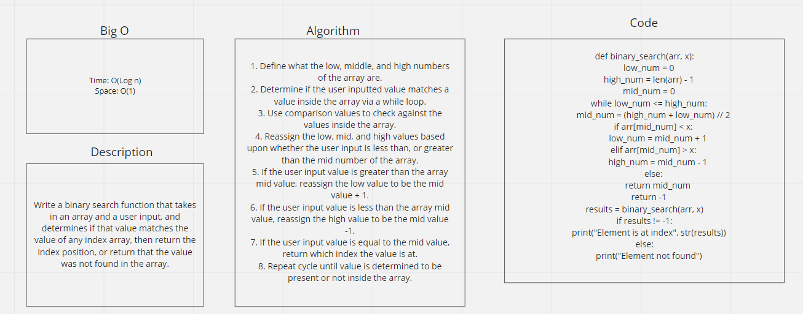

# Binary Search of Sorted Array
Write a binary search function that takes in an array and a user input, and determines if that value matches the value of any index array, then return the index position, or return that the value was not found in the array.

## Whiteboard Process

## Approach & Efficiency
I once again started out with figuring out how to code this particularly problem. Once I knew how the code worked, I was able to articulate the steps of the algorithm. Initially I thought about a for loop to solve this, but a while loop is what worked in the end. I wasn't familiar with Binary search methods before, so seeing the logic coded out really helped me understand it on a bigger picture level.
