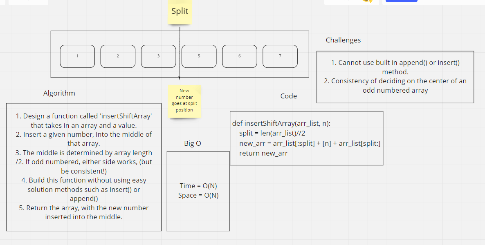

# insert_array_shift
## Describe the challenge
Write a function that takes in an array and a number, and inserts that given number into the middle of the array. Complete this without using the built in methods insert() or append() (or similar)

## Whiteboard Process

## Approach & Efficiency
My initial approach was figuring out how to solve this problem without using the built in methods. Once I figured that part out, I was able to start working on my algorithm and visualization. I sometimes think it would be better to define the algorithm before writing code, but with my limited experience, I don't always know which code is actually going to work. So I first have to start with testing my code, and getting that working, before I can start describing the steps.
