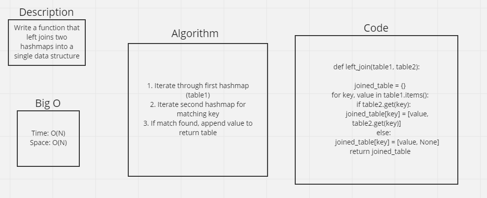

# Hashmap LEFT JOIN
Write a function called left_join that takes in 2 hashmaps, and returns a single hashmap.

## WhiteBoard

## Approach & Efficiency
I initially wanted to use a ** operator, then I found out about the | operator in python (new to 3.9). The | allows you to merge two dictionaries, however it doesn't seem to allow duplicate values to a key, so I had to use an iterative method instead.

## Solution
- [Solution code](https://github.com/KirkGarrison/data-structures-and-algorithms/blob/hashmap_left_join/python/code_challenges/hashmap_left_join/haspmap_left_join.py)
