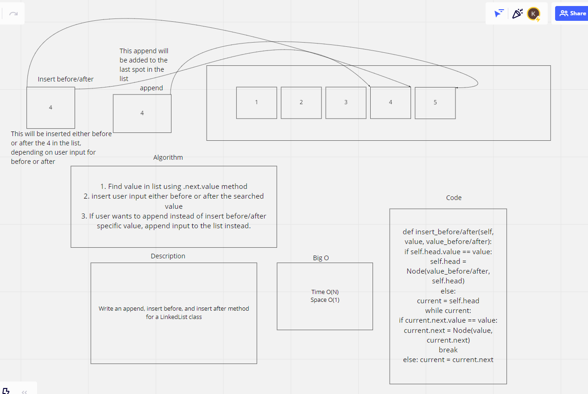
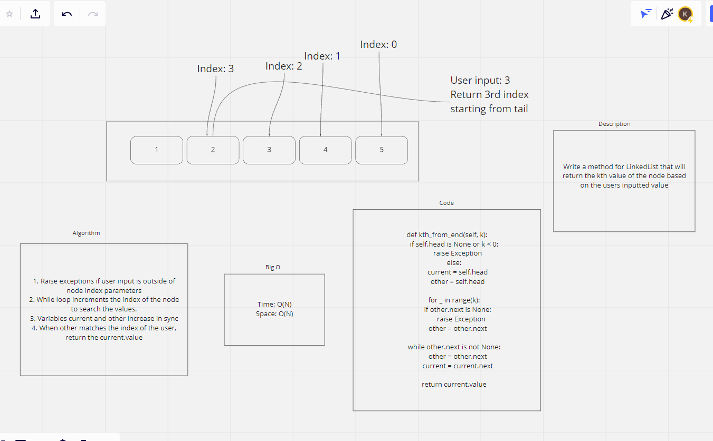

# Singly Linked List

# Challenge Summary
Write an append, insert before and insert after method for a LinkedList class.

## Whiteboard Process

## Approach & Efficiency
Since this challenge required tests and we had access to using a code editor, I began all of my work in VScode and started with writing tests, then used the red>green>refactor method to build out each test.

## Solution
https://github.com/KirkGarrison/data-structures-and-algorithms/blob/main/python/code_challenges/linked-list-insertions-two/linked_list_insertions/linked_list.py

# Kth position of linked list

## Challenge
Create a method to return the kth value of the node based on user input

## Whiteboard Process

## Approach & Efficiency
My approach was to review how I was able to get the nth value from the fibonacci sequence, then do some research on how I could apply that logic to finding it within a LinkedList.
## Solution
https://github.com/KirkGarrison/data-structures-and-algorithms/tree/main/python/code_challenges/linked-list-insertions-two
