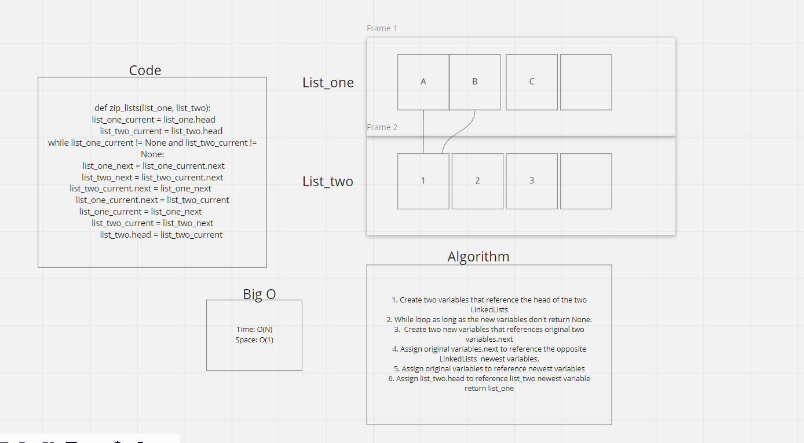

Challenge
Create a method that takes in two LinkedLists, and 'zips' them together to return a modified Linkedlist_one with both LinkedLists Nodes alternating

Whiteboard Process

Approach & Efficiency
My approach was to first figure out what this would look like in code, however I hit a wall with coding and needed to get a whiteboard example up to then see what this should be accomplishing. Once I had more of a visual idea of the goal, I was able to complete my code portion.
