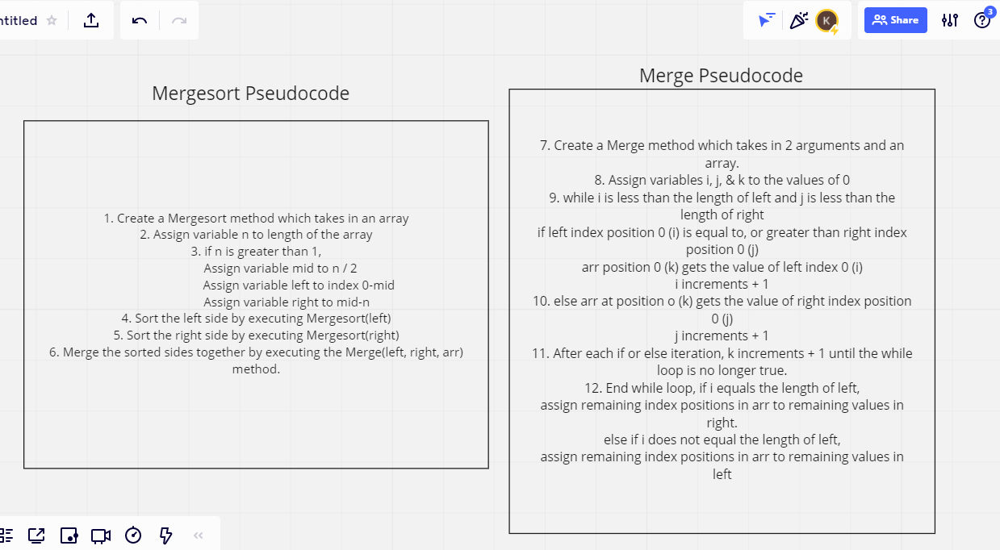
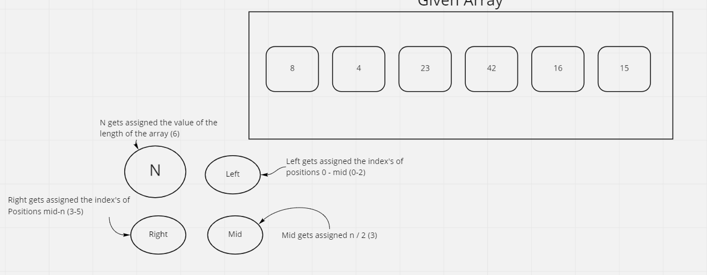
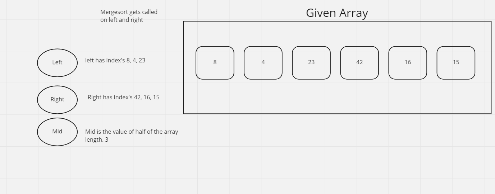
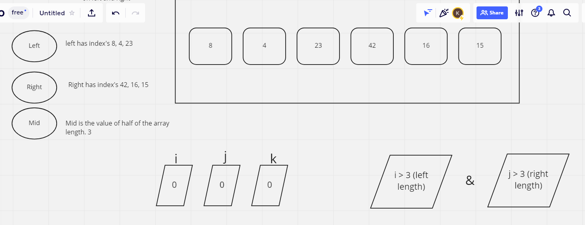
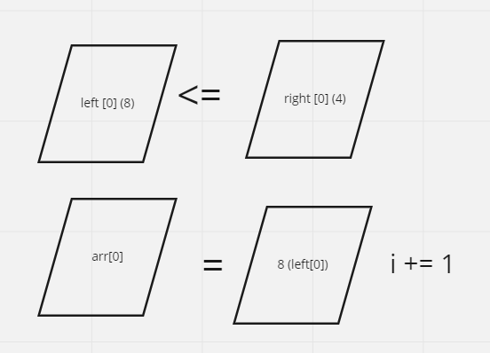

## PseudoCode

        ALGORITHM Mergesort(arr)
            DECLARE n <-- arr.length

            if n > 1
            DECLARE mid <-- n/2
            DECLARE left <-- arr[0...mid]
            DECLARE right <-- arr[mid...n]
            // sort the left side
            Mergesort(left)
            // sort the right side
            Mergesort(right)
            // merge the sorted left and right sides together
            Merge(left, right, arr)

        ALGORITHM Merge(left, right, arr)
            DECLARE i <-- 0
            DECLARE j <-- 0
            DECLARE k <-- 0

            while i < left.length && j < right.length
                if left[i] <= right[j]
                    arr[k] <-- left[i]
                    i <-- i + 1
                else
                    arr[k] <-- right[j]
                    j <-- j + 1

                k <-- k + 1

            if i = left.length
            set remaining entries in arr to remaining values in right
            else
            set remaining entries in arr to remaining values in left

## Example Array

        [8,4,23,42,16,15]

## Visualization

Algorithm for pseudocode split into 2 parts
Mergesort and Merge methods.

Given array and variables being assigned

Result of Mergesort variable executions

Merge variables being assigned, and the while loop truthiness evaluation based on first iteration

If while loop is true, if statement begins, and if statement is also true, first index value reassignment begins. i increments.

