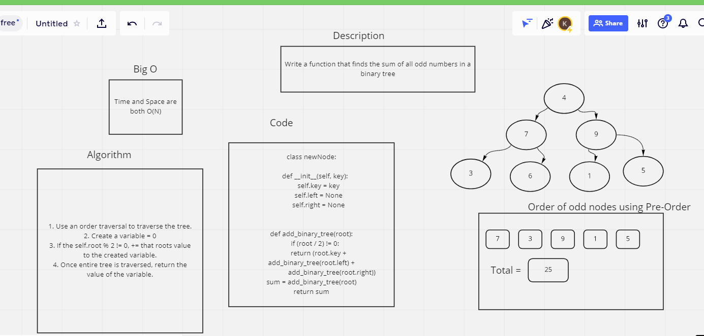

# Challenge Summary
Return the odd sum values from a binary tree.

## Whiteboard Process

## Approach & Efficiency
My approach was to use a pre-order tree traversal, and compare each node value with a modulo % 2, and if the remainder is not 0, then to += that value to an assigned variable.

## Solution
- [Solution link]()
