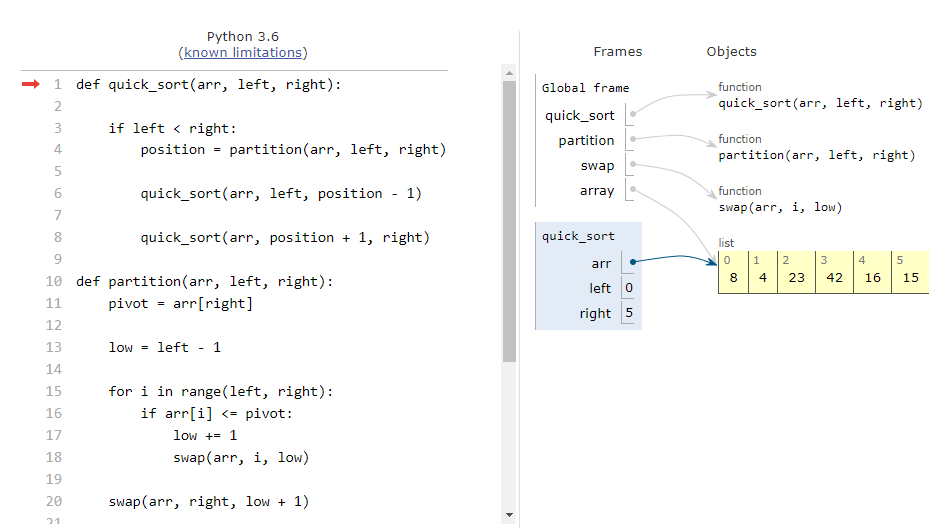
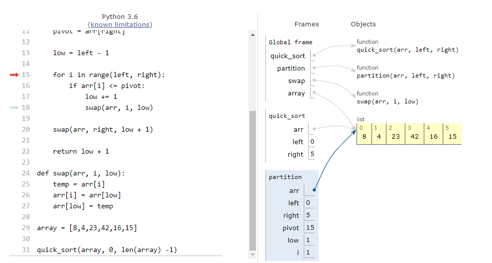
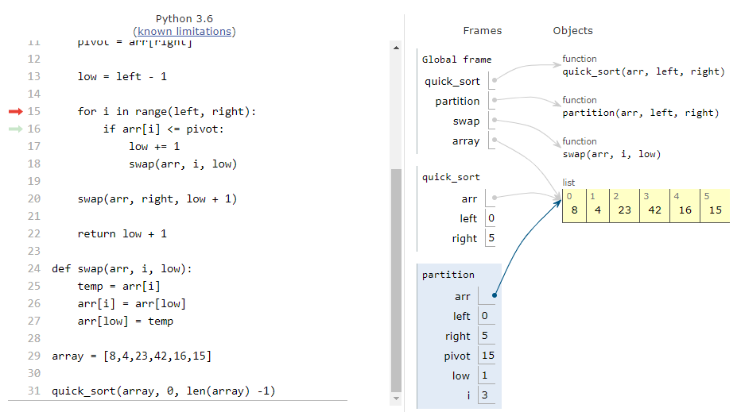

## Pseudocode

    ALGORITHM QuickSort(arr, left, right)
        if left < right
        // Partition the array by setting the position of the pivot value
        DEFINE position <-- Partition(arr, left, right)
        // Sort the left
        QuickSort(arr, left, position - 1)
        // Sort the right
        QuickSort(arr, position + 1, right)

    ALGORITHM Partition(arr, left, right)
        // set a pivot value as a point of reference
        DEFINE pivot <-- arr[right]
        // create a variable to track the largest index of numbers lower than the defined pivot
        DEFINE low <-- left - 1
        for i <- left to right do
            if arr[i] <= pivot
                low++
                Swap(arr, i, low)

     // place the value of the pivot location in the middle.
     // all numbers smaller than the pivot are on the left, larger on the right.
     Swap(arr, right, low + 1)
    // return the pivot index point
     return low + 1

    ALGORITHM Swap(arr, i, low)
        DEFINE temp;
        temp <-- arr[i]
        arr[i] <-- arr[low]
        arr[low] <-- temp

## Given array
    [8,4,23,42,16,15]

- [Python code](quick_sort.py)

- Quick_sort operates recursively to sort a given array.
- Steps:
    - 1. Define partition point of array and place values lower than the middle to the 'left', and all values higher to the 'right.'
    - 2. Recursively sort the values of the array.

    - 3. With the parition point defined, swap() and begin sorting values.

    - 4. Values are correctly sorted to the left and right side of the partition, quick_sort() both sides to sort each side.

    - 5. Return sorted array

