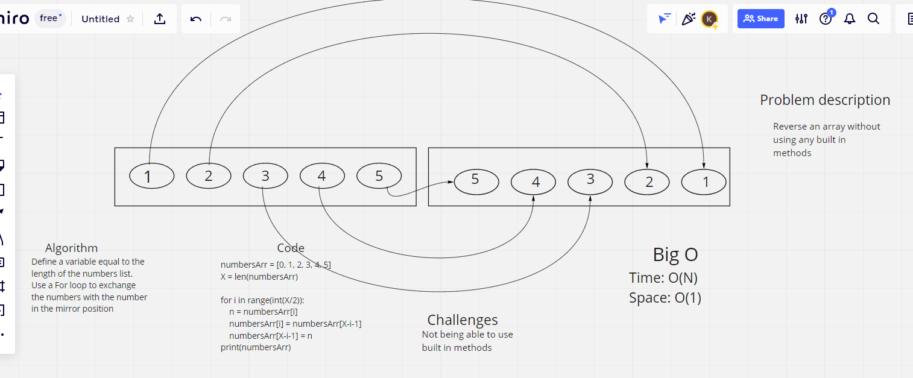

# Reverse an Array
- This challenge was difficult because we could not use any built in methods to reverse the array. So I had to figure out how to get this to work without reversed or slicing. We had to mimic a whiteboard process to document our thoughts and logic, as well as the code to complete this challenge.

## Approach & Efficiency
- My initial thoughts were some kind of For loop to make this happen, I just wasn't sure how to make that work. I also thought of using some type of
    *       array = [0, 1, 2, 3]
    *       switch = array[3, 2, 1, 0] print(switch)

- Now that logic didn't work, but it was where my head went at one point. After that I worked on the For loop to try to figure out how to do this.
