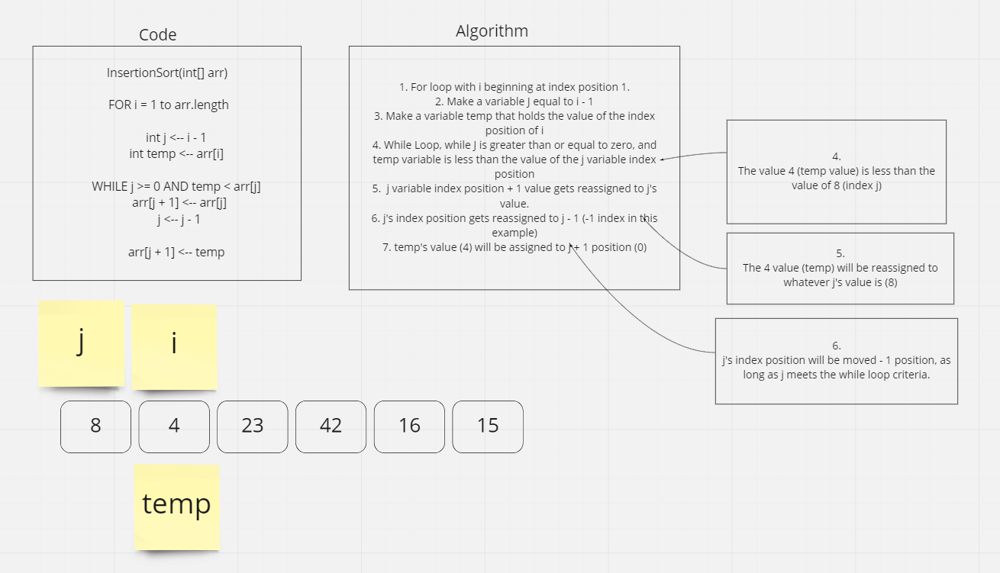
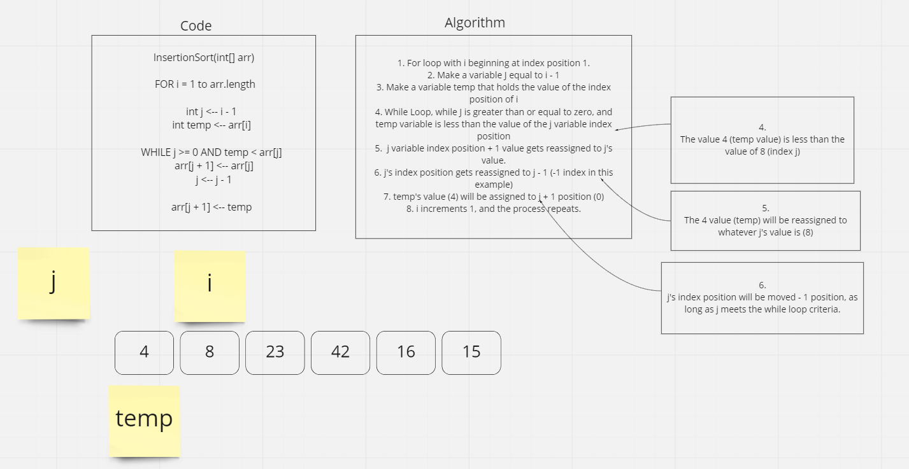
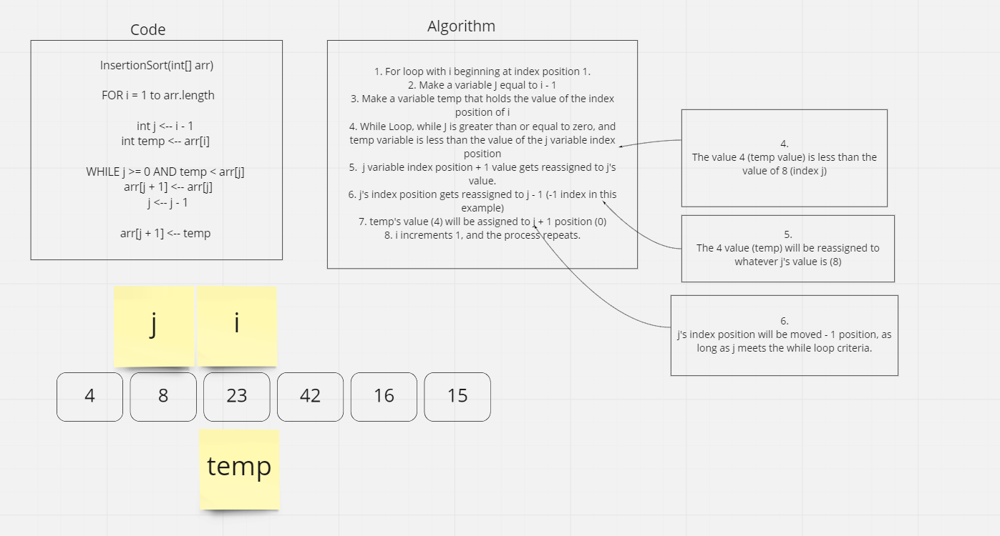

## Pseudocode

    InsertionSort(int[] arr)

    FOR i = 1 to arr.length

      int j <-- i - 1
      int temp <-- arr[i]

      WHILE j >= 0 AND temp < arr[j]
        arr[j + 1] <-- arr[j]
        j <-- j - 1

      arr[j + 1] <-- temp

## Example array

    [8,4,23,42,16,15]

## Process

Algorithm begins by assigning i variable to index 1, j variable to i - 1, and temp variable to i's index value.

While loop evaluates if j's index is less than, or equal to 0, and evaluates if the temp value is less than the j index value. If so, it enters the while loop.

Inside the while loop, the index position of j + 1 gets the value of j's current index.

j gets moved - 1 index position (in the photo example, it moves to position -1, thus also breaking the criteria for the while loop)

after the while loop, temp's value get's assigned to j + 1 index position. Thus 'swapping' j and i's original index position prior to the while loop.

The cycle begins again, incrementing i's index position by 1, and repeating the evaluations and reassignments of values.

Beginning of cycle 2:

