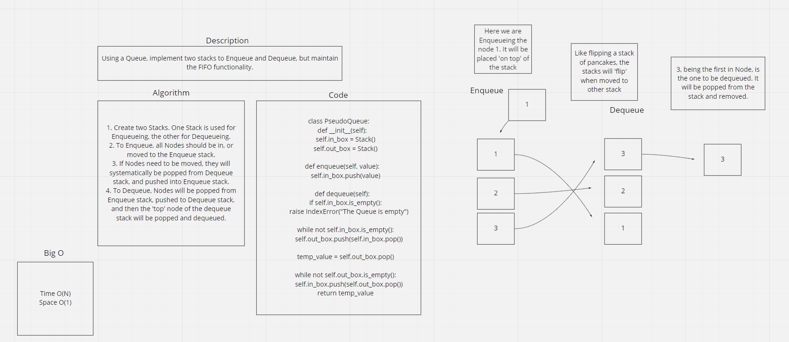

## Challenge
Create a Queue (FIFO) that uses 2 Stacks to enqueue and dequeue, but still maintains the FIFO usability.

Whiteboard

## Approach & Efficiency
Followed the foundational structure provided in the lecture, and referred to my previous implementation of Queue's and Stacks.
Enqueue Method:
Time O(N)
Space O(1)
Dequeue Method:
Time O(N)
Space O(1)

## API
No Api's used (yet)
