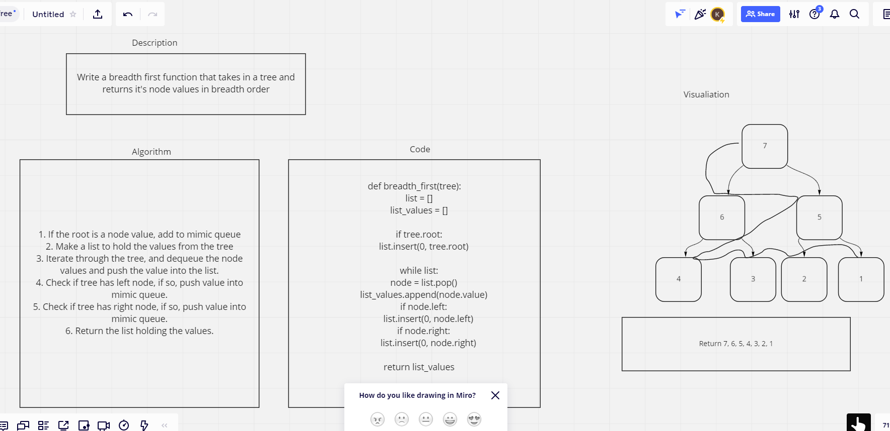

# Challenge Summary
Write a breadth first search that returns the node values in order of height.

## Whiteboard Process

## Approach & Efficiency
I went back and watched some of the lecture, as well as youtube videos on how to use breadth first code. I also implemented previous queue and node properties from previous labs.

## Solution
- [Solution Link](https://github.com/KirkGarrison/data-structures-and-algorithms/blob/tree_breadth_first/python/code_challenges/tree_breadth_first/tree_breadth_first.py)
