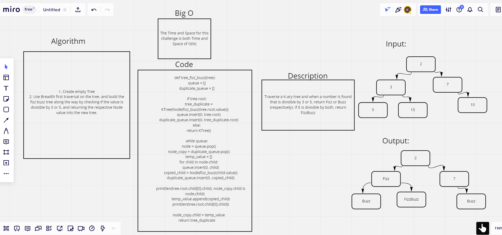

# Challenge Summary
Conduct a FizzBuzz challenge on a K-ary tree while traversing through it to create a new tree

## Whiteboard Process

## Approach & Efficiency
I referenced my previous fizzbuzz function, and used the internet for some references and ideas.

## Solution
- [Solution link]()
